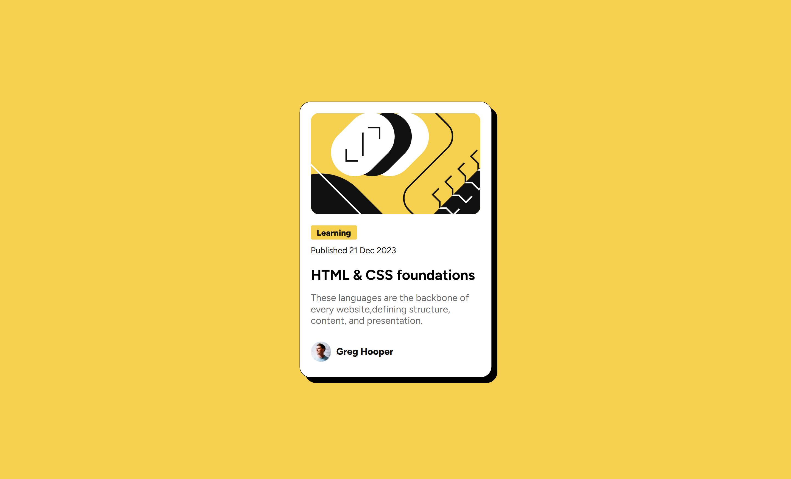

# Frontend Mentor - Blog Preview Card Solution

This is my solution to the [Blog preview card challenge](https://www.frontendmentor.io/challenges/blog-preview-card-ckPaj01IcS) on Frontend Mentor. It's a great beginner-level project for practicing semantic HTML, CSS layout, and responsive design.

## Table of contents

- [Overview](#overview)
  - [The challenge](#the-challenge)
  - [Screenshot](#screenshot)
  - [Links](#links)
- [My process](#my-process)
  - [Built with](#built-with)
  - [What I learned](#what-i-learned)
  - [Continued development](#continued-development)
- [Author](#author)

## Overview

### The challenge

Users should be able to:

- View the blog preview card layout
- See hover states on the blog title
- View a responsive design on different screen sizes

### Screenshot



### Links

- Solution URL: [Repo](https://github.com/4y0ub-kkkk/blog-card-preview)
- Live Site URL: [The site](https://4y0ub-kkkk.github.io/blog-card-preview/)

## My process

### Built with

- Semantic HTML5
- CSS custom properties (variables)
- Flexbox
- Mobile-first responsive design
- Google Fonts - Figtree

### What I learned

I practiced building a clean, responsive card component and using CSS variables for easier theming. I also got more comfortable with using `clamp()` for responsive font sizing and flexbox for layout control.

```css
--FS: clamp(1rem, 2.2vh, 1.2rem);
.card-footer {
  display: flex;
  align-items: center;
  gap: .5em;
}
